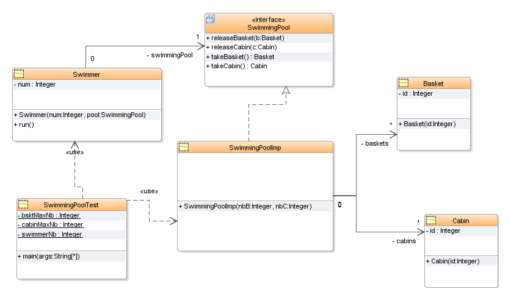
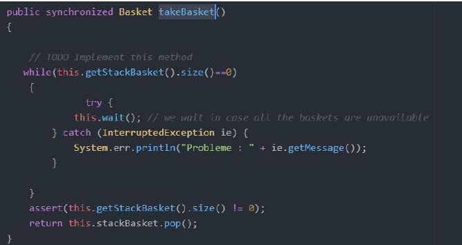
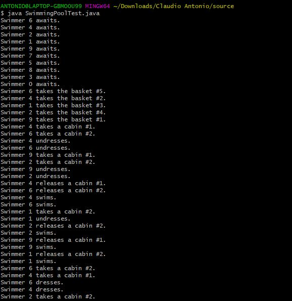

# Threads-in-Java

Simulation of swimming pool operation  We wish to model the operation of a swimming pool where the behaviour of each swimmer is represented by a Swimmer task (Swimmer class provided) associated with a synchronisation to protect access to the baskets and dressing or undressing cabins. It is assumed that the total number of places in the pool is limited to the number of baskets and that the number of cabins is less than the number of baskets. A swimmer, who comes to the pool, successively asks for a basket and a cabin, undresses, then frees the cabin, but not the basket containing his clothes. When the he asks for a cabin again, gets dressed and then frees the cabin and the basket which is now empty.  

For the realization of this assignment I implemented my code according to the following UML diagram:


<br>

The SwimmingPollImp class has all the methods of the SwimmingPool interface and two stacks, one representing the set of pool baskets and the other representing the set of cabins.
The Cabin class has an identifier as attribute idem for the Basket class.

## Relationships between classes :
- the number of swimmers waiting for a break;
At the level of the SwimmingPollImp class in the takeBasket method a swimmer can take a basket as long as the basket stack is not empty, otherwise it remains on standby, here is an extract of the code:




- the number of swimmers waiting for a cabin ;
At the level of the SwimmingPollImp class in the takeCabin method a swimmer can take a cabin as long as the stack of cabins is not empty, otherwise it remains on standby. Here is an extract of the code:


 the total number of swimmers ;
The total number of swimmers in the pool will depend on the number of cabins, as the number of cabins is less than the number of baskets, so the first swimmers to have taken the cabins and baskets will be swimming and the others will be waiting and those who already have a basket will be able to take a cabin next because they have to take the cabin and basket to be able to swim.
- the number of baskets ;
The number of baskets in a pool is determined by the integer that is passed as the first parameter when instantiating a SwimmingPoolImp object,
But this set will vary as the swimmers pick up the baskets.
- the number of cabins ;
The number of cabins in a pool is determined according to the integer passes as the second parameter when instantiating a SwimmingPoolImp object,
But this set will vary as swimmers pick up the cabins.


# How to compile 

you must first download the sources folder and then execute the following commands
remembered that you must have the java compiler on your pc  

      ```ANTONIO@LAPTOP-GBMO0U99 MINGW64 ~/Downloads/Claudio Antonio/source
      $ javac SwimmingPoolTest.java```





